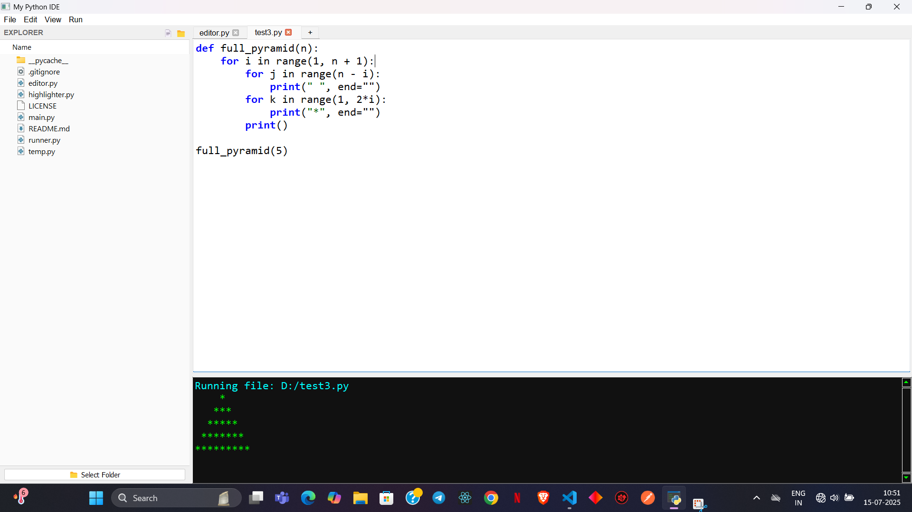

# 🐍 Python IDE (Built with PyQt5)

A modern, lightweight, and customizable Python IDE built entirely with **Python** and **PyQt5**. It features multi-tab support, an integrated terminal, syntax highlighting, auto bracket closing, and a file explorer — all packed into a sleek, minimal GUI.

---

## 🚀 Features

- 📄 **Multi-tab Editor** (like VS Code or Notepad)
- ➕ **Tab Add/Close Support** (like Notepad)
- 🧠 **Auto Bracket & Quote Closing** (`{}`, `""`, `''`, `()`, `[]`)
- 🎨 **Syntax Highlighting** with `QSyntaxHighlighter`
- 💾 **Open, Save, Create New Files**
- ▶️ **Run Python Code** with **real terminal I/O**
- 🖥️ **Integrated Terminal** for full **input/output (I/O) interaction**
- 📁 **File Explorer** with click-to-open and context menu
- ⌨️ **Keyboard Shortcuts**
  - `Ctrl + N` — New Tab
  - `Ctrl + S` — Save
  - `Ctrl + R` — Run Code
  - `Ctrl + F` — Find
  - `Ctrl + H` — Replace
- ↔️ **Resizable Terminal Area** via splitter

---

## 📸 Screenshots



---

## 🛠️ Installation

### 📦 Requirements

- Python 3.11+
- PyQt5

### 🔧 Install dependencies:

```bash
pip install PyQt5
