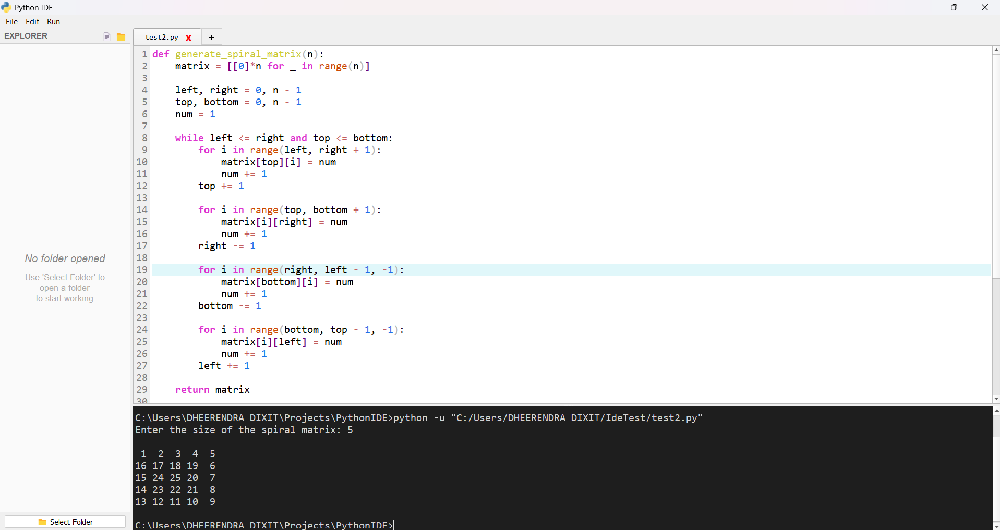
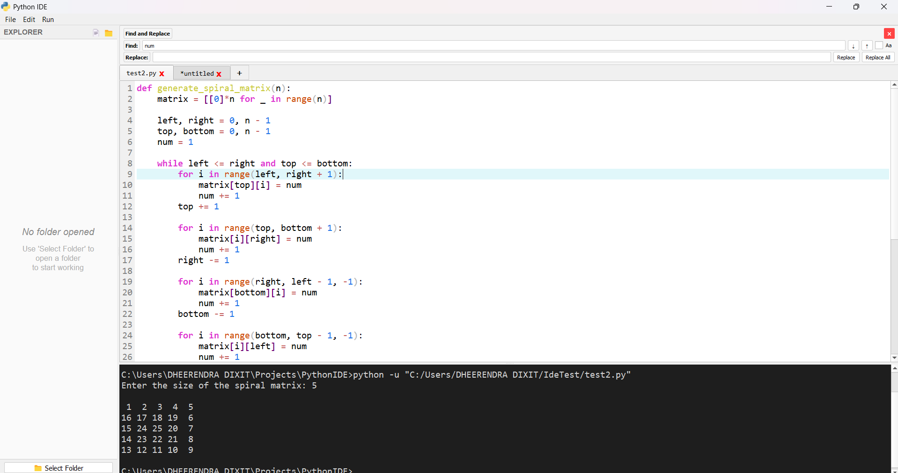
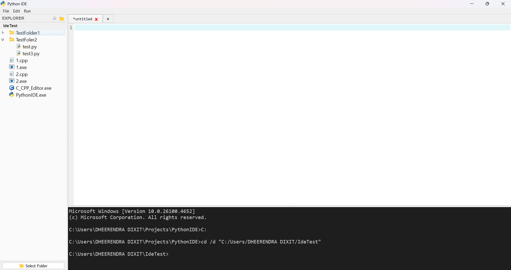

# 🐍 Python IDE (Built with PyQt5)

A modern, lightweight, and customizable Python IDE built entirely with **Python** and **PyQt5**. It features multi-tab support, an integrated terminal, syntax highlighting, auto bracket closing, intelligent autocompletion, and a file explorer — all packed into a sleek, minimal GUI.

---

## 🚀 Features

- 📄 **Multi-tab Editor** (like VS Code or Notepad)

- ➕ **Add New Tab Button** next to tabs (just like Notepad)

- 🧠 **Auto Bracket & Quote Closing** (`{}`, `""`, `''`, `()`, `[]`)

- 🎨 **Syntax Highlighting** with `QSyntaxHighlighter` for Python

- 🔢 **Line Numbers** for every editor tab

- 🔍 **Find and Replace** with find next and previous

- 💾 **Open, Save, Save As, New File** functionality

- ▶️ **Run Python Code** inside the IDE

- 🖥️ **Integrated Terminal** with real-time input/output (supports `input()`)

- 💡 **Jedi-powered Autocompletion** — Context-aware suggestions, variables, functions, and modules

- 📁 **File Explorer** on the left panel (navigate & open files)

- ⌨️ **Keyboard Shortcuts**
  - `Ctrl + N` — New File
  - `Ctrl + O` — Open File
  - `Ctrl + S` — Save File
  - `Ctrl + Shift + S` — Save As
  - `Ctrl + W` — Close Tab
  - `Ctrl + T` — New Tab
  - `Ctrl + R` — Run Code
  - `Ctrl + F` — Find
  - `Escape` — Hide Find Panel
- ↔️ **Resizable Panels** via `QSplitter` (Editor / Terminal / File Tree)

---

## 📸 Screenshots







---

## 🛠️ Installation

### 📦 Requirements

- Python 3.11+
- PyQt5
- Jedi

### 🔧 Install Dependencies

```bash
pip install PyQt5 jedi
